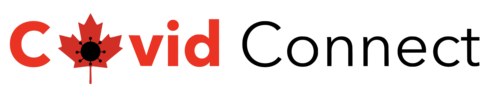

# COVID-19 Tracking App

# Team 15 - members:
|name                     |github id    |student id
|---                      |---          |---     
|Gianfranco Dumoulin  | gfdb | 40097768
|David Roper                | david-roper      | 40131739
|Marita Brichan | maritabrichan | 40138194
|Dionisia Poulios| dionisiapoulios | 40131986
|David Lemme| davrine| 40157270
|Maxwell Lee | Cresfault  | 40120326
|Omar Elkassouani|Omarelk09|40080394|
|Lea Lakkis|lealakkis|40125381
|Mohamed El-Chanati|mohamad-elchanati|40087462

# COVID Connect User Manual
### [The Deployed Website](http://fsoen390-env.eba-qktw2kmr.us-east-1.elasticbeanstalk.com/profile#loaded) --> [http://fsoen390-env.eba-qktw2kmr.us-east-1.elasticbeanstalk.com/profile#loaded](http://fsoen390-env.eba-qktw2kmr.us-east-1.elasticbeanstalk.com/profile#loaded)\

### [User Manual](https://docs.google.com/document/d/1ihr1aLmKUalMKJQBN8wvK3-xlgXYLMhxc0Uh3LEiXzU/edit?usp=sharing)

# Setting up project
1. Install node v16.13.2

2. Navigate to repository directory

3. To install npm enter the following command into the terminal:
``` 
npm install
```
4. Install ejs enter:
```
npm i ejs 
```
5. Install express:
```
npm i express
```
6. Install mysql2
```
npm i mysql2
```
7. Install bcrypt
```
npm i bcrypt
```
7.5 or use
```
npm i ejs express mysql2 bcrypt
```
8. Install nodemon
```
npm i nodemon --save-dev
```
9. navigate to package.json. Under the scripts name enter "start": "node,on server.js"

10. enter npm start into terminal (the server will automaticly restart upon saving any js file)

# Running Test
To run unit tests simply type
```
npm run test
```

To run unit tests and generate a coverage report in terminal
```
npm run coverage
```

To run unit tests and generate a full coverage report
```
npm run coverage-full
```


# Meeting
```diff
_________________________________________________________________________________________________________________________
Meeting #: 1   Date/time January 13 2022

Summary
- Gianfranco is project manager
- Next meeting Monday 6:15
- Meeting with TA every week Thursday 5:30, except the coming week it will be Tuesday at 6
- Came up with user stories
- Decided on user stories that will be done this sprint
- Split up the SAD

To-do
Ask TA:
   if the GitHub should be public or private
   how to access Concordia’s servers to be able to launch the web app and to set up a database using SQL?
   What’s with the empty boxes on the template for user stories document? Do we need to use those boxes? “Cards-UserStories.pdf”
Tasks 
   SAD
   Introduction & Stakeholders and concerns (Mohamed)	
   Viewpoints+ (David Roper, Franco, Max)
   Views+ (Lea, David Lemme,  Marita, Dionisia)
   Consistency and correspondences, Architecture decisions and rationale (Omar)
   Risk Assessment & Risk Management Plan 
   Tbd Monday
_________________________________________________________________________________________________________________________

Meeting #: 2   Monday, January 17, 2021 at 6:30PM

Summary
- Added more stories 
- Assigned priorities to stories belonging to sprint 1 
- Fixed stories that had TA comments on it 

To-do
Assess highlighted items in the user backlog
Start/Complete SAD and other relevant documentation
Discuss user backlog with TA during Tuesday’s meeting (January 18th)
_________________________________________________________________________________________________________________________

Meeting #: 3   January 19th, 7pm

Summary
- Finished user stories, added story points
- Broke down each user story and assigned tasks to members
To-do
Finish SAD for Monday
Start on each task assigned
_________________________________________________________________________________________________________________________

Meeting #: 4   January 24th  7 pm

Summary
- SAD review 
- Risk Assessment & Risk Management Plan  task division

To-do
Ask the questions we have & focus on UI
_________________________________________________________________________________________________________________________

Meeting #: 5   January 31 6:15PM

Summary
- How we will manage the rest of the documents: 
   Risk assessment: tonight
   Testing: tonight
   UBS & Formatting: tbd
   Sprint retrospectives: tbd

To-do
Risk assessment
Testing document
Meeting again before submission
_________________________________________________________________________________________________________________________

Meeting #: 6   February 7 8:00PM

Summary
- created tasks on github
- assigned tasks on github
- decided which stories were going to be done in sprint 3

To-do
work on each assigned task
_________________________________________________________________________________________________________________________

Meeting #: 7   February 14 8:00PM

Summary
- updated each other on our progress of our tasks

To-do
work on each assigned task

_________________________________________________________________________________________________________________________

Meeting #: 7   February 14 8:00PM

Summary
- updated each other on our progress of our tasks
- assigned the documentation

To-do
work on each assigned task

testing (franco, lemme, roper)
testing plan (franco, lemme, roper)
sad (each person updates their same part)
sprint retrospective 
website hosting (mohamad, dionisia)
update risk assessment (roper)
summary document (dionisia)
_________________________________________________________________________________________________________________________

Meeting #: 21   February 14 8:00PM

Summary
- updated each other on our progress of our tasks
- assigned the rest of the documentation

To-do
work on/finish each assigned task

testing (franco, lemme, roper)
testing plan (franco, lemme, roper)
sad (each person updates their same part)
website hosting (mohamad, dionisia)
update risk assessment (roper)
summary document (dionisia)
Sprint 2 retrospective (marita)
Sprint 3 Planning (lea)
_________________________________________________________________________________________________________________________

```


# Sprint 3
* All documents are are also linked through [this summary document](https://docs.google.com/document/d/161xKRNB66QsU2Sr3frIfAUPWsLMGZBavTv3-mXGrgrc/edit?usp=sharing)
1. [User Stories Backlog (USB) excel sheet](https://docs.google.com/spreadsheets/d/12L9rgUXGn508rjnKgYhErNIvxcseMZd9BCg0DDjf3aw/edit#gid=0)
2. [Release Plan (Sprint #4 planning)](https://drive.google.com/file/d/1wyBiMsmxK3zuAueZuVcW0YLwuEnmJpr9/view?usp=sharing)
4. [Software Architecture Document (SAD)](https://docs.google.com/document/d/1Vlq3SBM1zPuQGnx3fvnyioKAPnvmFM9waBz5x_Iiyuo/edit)
5. Risk Assessment & Risk Management Plan (RMP)\
      [The Risk Management Plan (RMP)](https://docs.google.com/document/d/1Jw6hj5Wdn0MUeDm7lBl1yclw7GDgP7OFVZAfSyAbvHQ/edit?usp=sharing)\
      [The Risk Analysis](https://docs.google.com/spreadsheets/d/197GQeYEscJZ31bu0-OaCv55lvQsjjKgstyS5xXJMvpw/edit?usp=sharing)
7. [UI prototype project for Sprints #1 and #2 user stories:](https://www.figma.com/files/team/1066065344629609374/SOEN-390?fuid=1067596830345618178)\
      [UI prototypes for Sprint #1](https://www.figma.com/file/eTfde749ktNYc97thhD57C/CovidConnect-Wireframes?node-id=59%3A2)\
      [UI prototypes for Sprint #2](https://www.figma.com/file/eTfde749ktNYc97thhD57C/CovidConnect-Wireframes?node-id=0%3A1)\
      [UI prototypes for Sprint #3](https://www.figma.com/file/eTfde749ktNYc97thhD57C/CovidConnect-Wireframes?node-id=233%3A476)\
      [UI prototypes for Sprint #4](https://www.figma.com/file/mXXT40sUoeiXIVGSVcHdtQ/SOEN-390-2?node-id=0%3A1)
9. [Testing Plan](https://docs.google.com/document/d/1VgDy2BLwzfAXHgdupFU7azPdxQsRbcEMQvTYg8KmJGA/edit?usp=sharing)
10. Running prototype
11. [Short sprint retrospective](https://docs.google.com/document/d/166-fmoFUSlk-s-px1eJL71O6XsbilRJLx2IoH23OID4/edit?usp=sharing)
